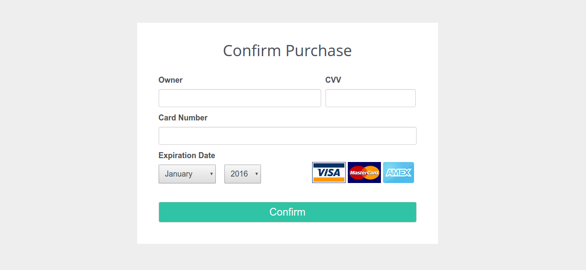

# 3d secure v 1.0.2 by steps#

**Flow of payment**


**1** - Customer send credit card info


**2** - Shop aka Merchant aka MPI (Merchant plugin) send two type of reqests:
    
    CRReq (Card Range Request) - Need to find Issuer Bank 
[CRReq and CRRes example](./Messages%20Examples/CRReqCRRes.md)

    VeReq (Verify Enrollment Request) - Need to validate card number on Issuer Bank and get some information for payment flow 
    
[VeReq and VeRes example](./Messages%20Examples/VeReqVeres.md)

These two types of requests customer can't see.

MPI get some information from VERes:

    Message id: 999 
    Url to redirect: https://acs.bank.com/3ds
    enrolled: Y

**3** - If enrolled = Y, MPI construct [PaReq](./Messages%20Examples/PareqPares.MD)

**4** - MPI send PaReq via customers browser (redirect) and customer get Bank form for enter OTP code. A customer sees something like that:


**5** - Customer return to shop website, after verification (redirect this PaRes)

**PaRes has Signature** (```Signature=base64(RSA with SHA2-256(utf8bytes(value1;value2;...;value n;))```) or Digest (Encripted string Concatenated param this Secret). And MPI can check PaRes using Digest or Signature.

**PaReq hasn't a Signature**. And the customer can change this message.