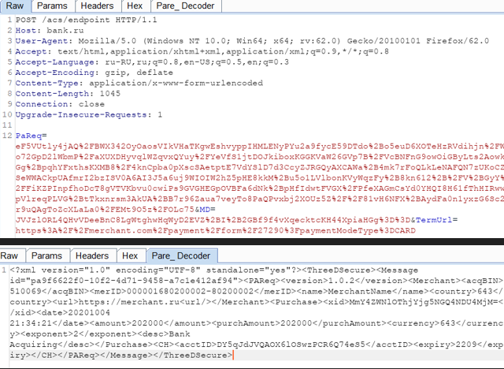
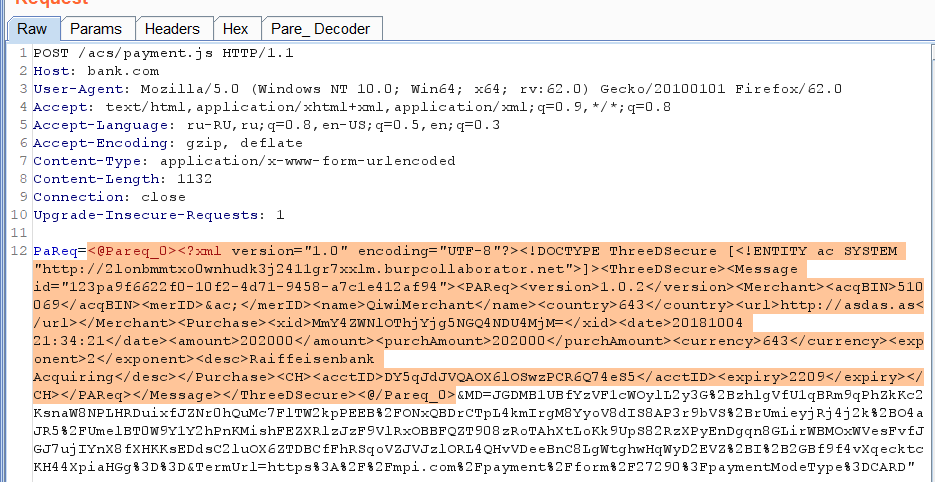

# 3d secure #

## Intro ##

**3d secure (3ds)** is an XML-based protocol designed to be an additional security layer for online credit and debit card transactions. 

The basic concept of the protocol is to tie the financial authorization process with online authentication. This additional security authentication is based on a three-domain model (hence the 3-D in the name itself). 

**The three domains are**:

- Acquirer domain (the bank and the merchant to which the money is being paid).
- Issuer domain (the bank which issued the card being used).
- Interoperability domain (the infrastructure provided by the card scheme, credit, debit, prepaid or other types of a payment card, to support the 3-D Secure protocol). It includes the Internet, merchant plug-in, access control server, and other software providers

For nowadays you can find 2 main versions of the protocol: v1 and v2.

Most popular is v1.0.2, but the newest is version 2.2

## Why it is interesting? ##

Because customer (hacker), may change some messages in this protocol. 

Interesting messages:

    PaReq (payment request) for version 1.0.2

    CReq (chaleng request) for version 2.*


# Quick cheatsheet #

## What you may do? ##
[More detailed about v1.0.2](./3ds1.0.MD)

1) Try to buy something (more than 1000 rub).
2) Intercept POST request this PaReq. Its body looks like:

```xml
MD=5ebde4d3-3796-7a4d-5ebd-e4d300003dd0
&PaReq=eJxVUk1zgjAQ%2FSsOd8wHqMFZ49iiowfFtnam9oYhCh0BDdih%2FvomCLVmctj3duft5m1gXKXHzrdURZJnI4t0sdWRmcijJDuMrPfNzGbWmMMmVlL6b1JclOSwlEURHmQniUbWTniu8PbY3hMqbJe5rh16bmRHUuxZj2HWk8LisJ68yjOHphHXfboUUAu1ohJxmJUcQnF%2BWqw4oc7tAmoYSKVa%2BHzAsDnUoZ7O3TjIwlTy7WTlTz%2B6y2A13QKqKRD5JSvVD%2B%2B7urgFcFFHHpflaYiMQN24K%2FIUkEkAug%2Bzvpio0EJVEvHVdYoD%2FyUsIn2X1wMN%2FAUNNkKTkxEgUwJRWEpOMWEEY7dDvGGPDJ0BoJqHMDUjcIJ1Vj%2FshuBkukweUv8p0KYrvZP2FS0CWZ3yTOoK7eRfDOg%2B9PPc%2BClKbREZYM8hbp958%2BRLneOY7Wes90l31XJrLK6LjGKiDaIYk1rSAEBGBjULRM3udfTwJ34BmTq71w%3D%3D
&TermUrl=https%3A%2F%shop.ru%2Fgates%2F3ds
```

3) Check TermURL and MD for the possibility of XSS. This params is always reflected
4) Decode PaReq parm and get something like this (use plugins for Burp):

```xml
<?xml version="1.0" encoding="UTF-8"?>
<ThreeDSecure>
	<Message id="123-123-123-123-123-123">
		<PAReq>
			<version>1.0.2</version>
			<Merchant>
				<acqBIN>510069</acqBIN>
				<merID>123123123123123</merID>
				<name>MerchantName</name>
				<country>643</country>
				<url>http://asdas.as</url>
			</Merchant>
			<Purchase>
				<xid>U3Vic2NyaWJlX0B3ZWJyMGNr</xid>
				<date>20181004 21:34:21</date>
				<amount>202000</amount>
				<purchAmount>202000</purchAmount>
				<currency>643</currency>
				<exponent>2</exponent>
				<desc>AcquirerName</desc>
			</Purchase>
			<CH>
				<acctID>DYasdVQAOX6as3dfcxccwzPCR6Q74eS5</acctID>
				<expiry>2209</expiry>
			</CH>
		</PAReq>
	</Message>
</ThreeDSecure>
```
5) Check PaReq for the possibility of XXE
   
*Most of the implementations of ACS server is getting all input PaReq and you not nead do full chain*

5.1) Helpful answers! ACS returns some different errors, which may be used for check internal servers, ports or files (ssrf way)

```xml
<ThreeDSecure><Message id="poEpShmja0A36YWe0JOyr4Zt"><Error><version>1.0.2</version><errorCode>99</errorCode><errorMessage>Permanent system failure.</errorMessage><errorDetail>Failed to build error message.</errorDetail></Error></Message></ThreeDSecure>


<errorCode>5</errorCode><errorMessage>Format of one or more elements is invalid according to the specification.</errorMessage>

<errorCode>98</errorCode><errorMessage>Transient system failure</errorMessage>

<errorCode>4</errorCode><errorMessage>Critical element not recognized</errorMessage>
```

6) You may change "amount" and "purchAmount" params in PaReq and try to buy something chipper whan it realy coast

## Where you may find it? ##

Host name like:
- acs
- 3ds
- 3ds
- secure
- cap
- payments
- ecm
- 3dsauth
- testacs
- card

Payment Endpoints like:
- /acs/pareq/___uid___
- /acspage/cap?RID=14&VAA=B
- /way4acs/pa?id=____id____
- /PaReqVISA.jsp
- /PaReqMC.jsp
- /mdpayacs/pareq
- /acs/auth/start.do


*If you know useful scripts or plugins - send me and I add they to this cheatsheet*

# Links #
[Web payments wiki](https://github.com/w3c/webpayments/wiki)

[EMV 3Dsecure spec](https://www.emvco.com/emv-technologies/3d-secure/)

[3Ds SAAS example](https://3dsserver.netcetera.com/3dsserver-saas/doc/current/schema/3ds-api.html)

[Modified Decoder Improved - grandpa of my plugins](https://github.com/J-Run/Decoder-Improved)

# Burp plugins for 3d secure v1.0.2 #

**pare_decoder.py** - create tabs this decrypted PaReq and PaRes params in requests and response


**hackvector_pareq.jar** -  hackvector modification, with function enc/decode PaReq



*Cheatsheet for v2 in progress*